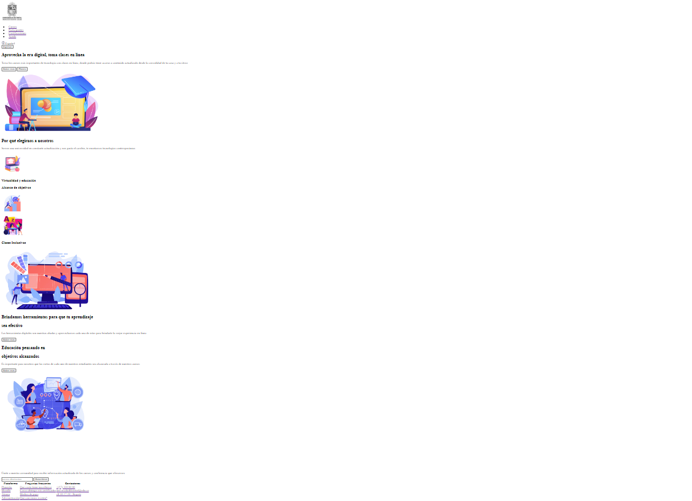
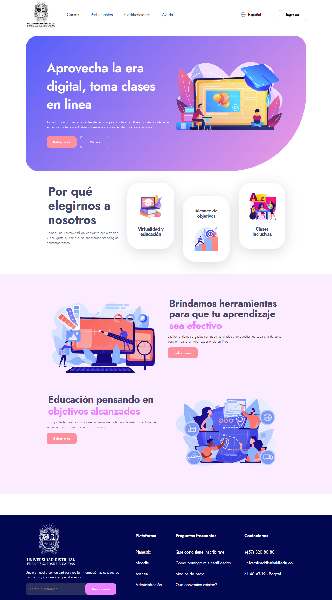

<h1>TALLER ANGELICA RINCON</h1>

<h2>Informacin</h2>

Curso: Full Stack Basico - Grupo 1

<h2>Punto 1: Link de Figma</h2>
<a href="https://www.figma.com/file/9ZVD5EgmtRyV2KttBI3NQN/ANGELICA-RINCON---FIGMA-EXERCISE?type=design&node-id=0-1" target="blank">Link de Figma</a>

<h2>Punto 2: HTML</h2>

<h2>Punto 3: CSS</h2>
